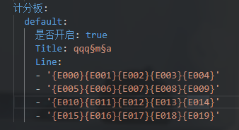
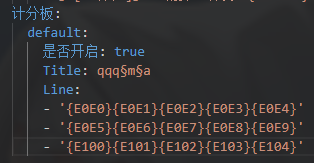

# UnicodeVariables

## 注意:
**该插件已停止维护，相关功能已合并到[NewTipsVariables](https://github.com/stevei5mc/NewTipsVariables)中，请使用[NewTipsVariables](https://github.com/stevei5mc/NewTipsVariables)插件**

## 用法展示
|||
|-|-|
|||

## 使用教程
> **1、下载该插件并放到`plugins`文件夹**  
> **2、确保安装了前置插件**[Tips](https://ci.lt-name.com/job/Tips/)**后重启服务器方可使用**  
> **3、首先你要知道你想要的通过变量来显示的图标所在的位置**  
> **例如你想要显示金币的图标那么就要确定金币图标所在的位置**  
>   
> **glyph_E1.png**  
> **如上图所示金币的图标在glyph_E1的第0行第2列(16进制表示)** 
> **那么金币图标的变量就为`{E102}`** 
> **其他的图标变量值也是这么确定的**
> **注意变量必须要以 `{`开头 `}`结尾 中间是图标所在位置 例`E102`** 